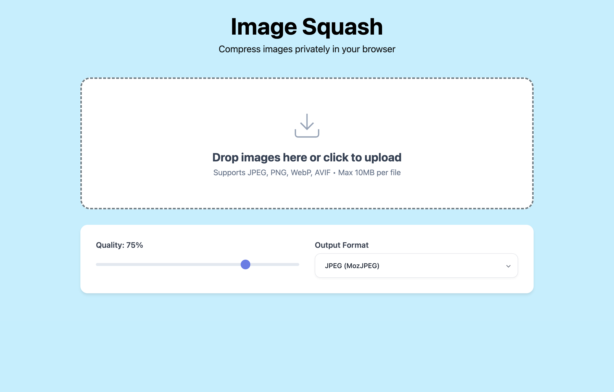

# ImageSquash

An image compression web app that runs entirely in your browser. Compress images to JPEG, WebP, or AVIF formats with no server uploads required.

## Supported Formats

### Input Formats

- JPEG/JPG
- PNG
- WebP
- AVIF

### Output Formats

- **JPEG (MozJPEG)**: Best compression for photos with excellent compatibility
- **WebP**: Modern format with good compression and wide browser support
- **AVIF**: Latest format with superior compression (newest browsers)

## Technology Stack

- **Frontend**: SvelteKit + Vite
- **Compression**: WebAssembly (WASM) encoders
  - MozJPEG encoder (~300 KB)
  - WebP encoder (~325 KB)
  - AVIF encoder (~2.8 MB)
- **Styling**: Custom CSS with modern design
- **Build**: Static site generation for easy deployment

## Installation & Development

### Prerequisites

- Node.js (version 16 or higher)
- npm or yarn

### Setup

```bash
# Clone the repository
git clone https://github.com/onlycodeblog/image-compressor.git
cd image-compressor

# Install dependencies
npm install

# Start development server
npm run dev
```

Visit `http://localhost:5173` to see the app in development mode.

### Build for Production

```bash
# Create production build
npm run build

# Preview production build locally
npm run preview
```

The built files will be in the `dist/` directory, ready for deployment.

## How to Use

1. **Upload Images**: Drag and drop images or click to select files (max 10MB each)
2. **Choose Format**: Select output format (JPEG, WebP, or AVIF)
3. **Set Quality**: Adjust quality slider (1-100%, default: 75%)
4. **Process**: Images are compressed automatically upon upload
5. **Download**: Download individual images or all as ZIP file

## Project Structure

```
image-compressor/
├── src/
│   ├── App.svelte             # Main app component
│   ├── main.js                # Entry point
│   ├── utils/                 # Image decoding helpers
│   └── codecs/                # WASM encoder modules
│       ├── mozjpeg/           # MozJPEG encoder
│       ├── webp/              # WebP encoder
│       └── avif/              # AVIF encoder
├── public/
│   └── index.html             # Entry HTML
├── style.css                  # Global styling
├── package.json               # Dependencies and scripts
├── package-lock.json          # Dependency lock file
├── vite.config.mjs            # Vite build configuration
└── README.md                  # Project documentation


```

## Browser Compatibility

**Note**: AVIF support varies by browser.

## Preview



## Acknowledgments

- [codecs](https://github.com/GoogleChromeLabs/squoosh/tree/dev/) - GoogleChromeLabs/squoosh
- [Svelte](https://svelte.dev/) - The web framework
- [Vite](https://vitejs.dev/) - Build tool and development server

---
